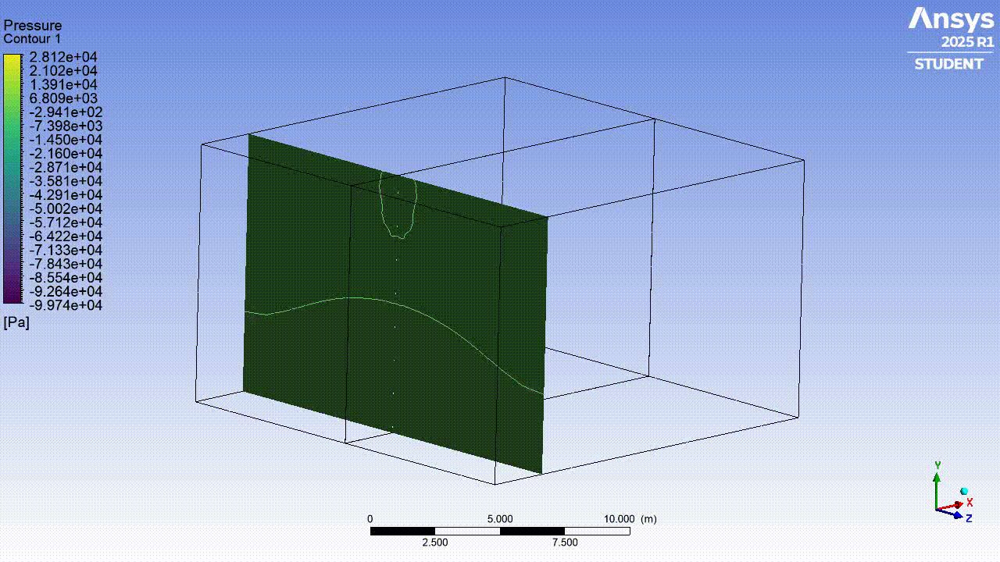

## Overview
This project presents a computational analysis of three-dimensional wing aerodynamics, a key aspect in aircraft design. Two wings with different geometric characteristics but common airfoils are considered: a NACA 7715 at the root and a NACA 0009 at the tip. The study focuses on evaluating how variations in sweep angle, aspect ratio, and taper ratio affect overall performance through simulations in ANSYS Fluent.

ANSYS Fluent, one of the leading tools in computational fluid dynamics (CFD), directly solves the Navier–Stokes equations using models such as RANS or LES, including turbulence approaches like SST. This enables the capture of three-dimensional flow phenomena such as separation, vortices, and recirculation, providing a more realistic representation of aerodynamic behavior near the wing surface.

| Property                                | Wing 1 | Wing 2 |
|-----------------------------------------|--------|--------|
| Sweep angle (°)                         | 0      | 15     |
| Taper ratio                             | 1      | 0.3    |
| Aspect ratio                            | 5      | 10     |
| Root chord [m]                          | 1      | 1      |
| Dihedral angle (°)                      | 0      | 0      |

  

## Objectives
- To design and simulate complex three-dimensional wing structures in ANSYS Fluent
- To analyze the effect of wing geometric characteristics on 3D aerodynamics

## Software & Tools
- **Airfoil Tools**: NACA 4-digit generator (.dat file).  
- **Ansys Workbench**:  
  - *SpaceClaim*: Geometry modeling.  
  - *Meshing*: Grid generation.  
  - *Fluent*: CFD simulation and post-processing. 
